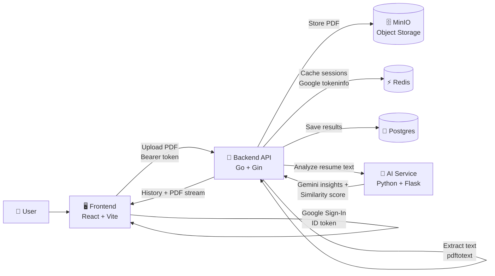

# Smart Placement AI ⚡

Smart Placement AI is a self-hosted resume analyzer that combines:
✅ a lightweight similarity model + 🤖 Gemini insights, with 🔐 Google sign-in and 📜 per-user history.

## Highlights ✨

- 🧠 Resume analysis (strengths, weaknesses, ATS notes, rewrite suggestions)
- 📈 Match score (0–100) and recommended roles
- 🔐 Google ID-token auth (verified + cached in Redis)
- 🗄️ PDFs stored in MinIO + viewable from the UI
- 🐘 Results stored in Postgres + `/history` per account

## How It Works (1-minute mental model) 🧩

1) Frontend gets a Google **ID token**
2) Backend verifies token (Google `tokeninfo`) and caches it in **Redis**
3) Upload → backend extracts text, stores the PDF in **MinIO**, calls the **AI service**
4) Backend stores the result in **Postgres** and shows it in **History**

## Architecture 🗺️



## Run (Docker) 🐳

Create `.env` from `.env.example`, then:

```bash
docker compose up -d --build
```

## Configuration 🔧

Minimum required:

- 🔑 `GEMINI_API_KEY` (AI service)
- 🐘 `POSTGRES_USER`, `POSTGRES_PASSWORD`, `POSTGRES_DB`
- 🗄️ `MINIO_ROOT_USER`, `MINIO_ROOT_PASSWORD`
- ⚡ `REDIS_HOST`, `REDIS_PORT` (password optional)

Google OAuth note:

- The frontend currently has a **hard-coded Google OAuth Client ID** in `frontend/src/main.tsx`.
  For a real open-source setup, replace it with your own Client ID.

## Endpoints (what you’ll actually hit) 🧪

- `POST /upload` (PDF multipart form) — 🔒 requires `Authorization: Bearer <google_id_token>`
- `GET /history` — 🔒 requires auth
- `GET /uploads/:filename` — 🔒 requires auth (also supports `?token=<id_token>` for inline viewing)

## Notes 📌

- PDF text extraction uses `pdftotext` (Poppler). The backend container installs it.
- The AI service can bootstrap a basic similarity model even without the dataset.
- Want to retrain similarity scoring? The AI service exposes `POST /train` (treat as admin-only).

## License 📄

No license file is included yet. If you’re planning to publish this as OSS, add a `LICENSE` (e.g., MIT/Apache-2.0) to clarify usage rights.
