# Smart Placement AI ⚡


Smart Placement AI is a self-hosted resume analyzer that combines:
✅ a lightweight similarity model + 🤖 Gemini insights, with 🔐 Google sign-in and 📜 per-user history.

## Highlights ✨

- 🧠 Resume analysis (strengths, weaknesses, ATS notes, rewrite suggestions)
- 📈 Match score (0–100) and recommended roles
- 🔐 Google sign-in (pre-configured, works out of the box!)
- 🗄️ PDFs stored in MinIO + viewable from the UI
- 🐘 Results stored in Postgres + `/history` per account

## How It Works (1-minute mental model) 🧩

1) Sign in with **any Google account** (no setup needed!)
2) Upload your resume PDF
3) Backend extracts text, stores PDF in **MinIO**, calls **AI service**
4) AI analyzes with Gemini + similarity model
5) View results + access your **History** anytime

## Architecture 🗺️

```mermaid
flowchart LR
    U[👤 User] --> F[🖥️ Frontend<br/>React + Vite]
    
    F -->|1. Google Sign-In| G[🔐 Google OAuth]
    G -->|ID Token| F
    
    F -->|2. Upload PDF + Token| B[🧠 Backend<br/>Go + Gin]
    
    B -->|3. Extract Text| B
    B -->|4. Store PDF| M[(🗄️ MinIO)]
    B -->|5. Verify Token| R[(⚡ Redis)]
    
    B -->|6. Analyze Text| A[🤖 AI Service<br/>Python]
    A -->|Call Gemini| AI[✨ Gemini API]
    AI -->|Insights| A
    
    A -->|7. Results| B
    B -->|8. Save Results| DB[(🐘 Postgres)]
    
    B -->|9. Response| F
    F -->|10. Display| U
    
    style F fill:#6366f1,stroke:#4f46e5,stroke-width:3px,color:#fff
    style B fill:#8b5cf6,stroke:#7c3aed,stroke-width:3px,color:#fff
    style A fill:#ec4899,stroke:#db2777,stroke-width:3px,color:#fff
    style G fill:#f59e0b,stroke:#d97706,stroke-width:3px,color:#fff
    style AI fill:#f59e0b,stroke:#d97706,stroke-width:3px,color:#fff
    style DB fill:#10b981,stroke:#059669,stroke-width:3px,color:#fff
    style R fill:#10b981,stroke:#059669,stroke-width:3px,color:#fff
    style M fill:#10b981,stroke:#059669,stroke-width:3px,color:#fff
    style U fill:#64748b,stroke:#475569,stroke-width:3px,color:#fff
```



## Run (Docker) 🐳

**Quick Start (Production - no clone needed!):**

*Linux/Mac:*
```bash
# 1. Download compose file
wget https://raw.githubusercontent.com/Nidhi018/Smart-Placement-Ai/main/docker-compose.yml
 (only GEMINI_API_KEY is required!)
cat > .env << EOF
GEMINI_API_KEY=your_gemini_api_key_here
POSTGRES_USER=postgres
POSTGRES_PASSWORD=password
POSTGRES_DB=placement_db
MINIO_ROOT_USER=minioadmin
MINIO_ROOT_PASSWORD=minioadmin
REDIS_HOST=redis
REDIS_PORT=6379
REDIS_PASSWORD=
EOF

```

*Windows PowerShell:*
```powershell
# 1. Download compose (only GEMINI_API_KEY is required!)
@"
GEMINI_API_KEY=your_gemini_api_key_here
POSTGRES_USER=postgres
POSTGRES_PASSWORD=password
POSTGRES_DB=placement_db
MINIO_ROOT_USER=minioadmin
MINIO_ROOT_PASSWORD=minioadmin
REDIS_HOST=redis
REDIS_PORT=6379
REDIS_PASSWORD=
"@ | Out-File -FilePath .env -Encoding utf8

```

```bash
docker compose up -d
```

**Or clone the repo:**

```bash
git clone https://github.com/Nidhi018/Smart-Placement-Ai.git
cd Smart-Placement-Ai
cp .env.example .env
# Edit .env and add your GEMINI_API_KEY
docker compose up -d
```

**Development (builds locally):**

```bash
docker compose -f docker-compose.dev.yml up --build
```

**Pre-built Images:**
- `ghcr.io/nidhi018/smart-placement-ai-frontend:latest`
- `ghcr.io/nidhi018/smart-placement-ai-backend:latest`
- `ghcr.io/nidhi018/smart-placement-ai-service:latest`

## Configuration 🔧

**Required (only this!):**

- 🔑 `GEMINI_API_KEY` - Get your free key from [Google AI Studio](https://ai.google.dev/)

**Database & Storage (defaults work fine):**

- 🐘 `POSTGRES_USER`, `POSTGRES_PASSWORD`, `POSTGRES_DB`
- 🗄️ `MINIO_ROOT_USER`, `MINIO_ROOT_PASSWORD`
- ⚡ `REDIS_HOST`, `REDIS_PORT` (password optional)

**Google OAuth:**

✅ Already configured! Just sign in with any Google account - no OAuth setup needed.

> **Note:** For production deployment, replace the OAuth Client ID in `frontend/src/main.tsx` with your own.

## Endpoints (what you’ll actually hit) 🧪

- `POST /upload` (PDF multipart form) — 🔒 requires `Authorization: Bearer <google_id_token>`
- `GET /history` — 🔒 requires auth
- `GET /uploads/:filename` — 🔒 requires auth (also supports `?token=<id_token>` for inline viewing)

## Notes 📌

- PDF text extraction uses `pdftotext` (Poppler). The backend container installs it.
- The AI service can bootstrap a basic similarity model even without the dataset.
- Want to retrain similarity scoring? The AI service exposes `POST /train` (treat as admin-only).

## Building & Publishing Images 🏗️

**Option 1: GitHub Actions (Recommended)**

Go to GitHub → Actions → "Build and Push Docker Images" → Run workflow
- Enter version (e.g., `v1.0.0`) or leave empty for `latest`
- Click "Run workflow"
- Done! ✅
```

Make sure you're logged into GitHub Container Registry first:
```bash
echo $GITHUB_TOKEN | docker login ghcr.io -u USERNAME --password-stdin
```

## License 📄

This project is licensed under the MIT License - see the [LICENSE](LICENSE) file for details.
